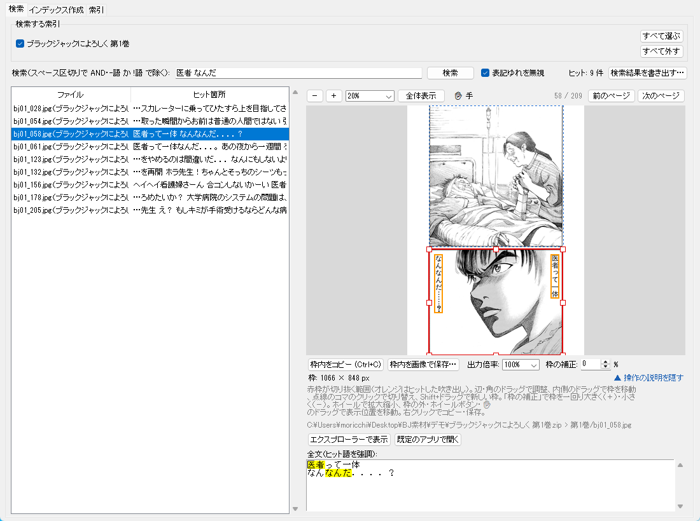

# KomaSagashi（コマ探し）

**画像の中の文字で、画像を探す。**

フォルダ内の画像（漫画のページ・スクリーンショットなど）を OCR して索引を作り、
キーワード検索でヒットした画像をその場でプレビュー・エクスプローラーで開けるデスクトップツールです。
日本語の縦書き・吹き出しに強い [manga-ocr](https://github.com/kha-white/manga-ocr) / [mokuro](https://github.com/kha-white/mokuro) を OCR エンジンに使っています。



「医者 なんだ」で検索し、ヒットした吹き出し（オレンジ）を含むコマが自動で赤枠に囲まれたところ。
書庫（zip）の中の 209 ページから 9 ページがヒットしています。

<sub>画面内の漫画：ブラックジャックによろしく　佐藤秀峰（[二次利用フリー](https://densho810.com/free/)）</sub>

## こんなときに

- 自炊した漫画から「あのセリフのページ」を探したい
- 大量のスクリーンショットから、特定の文字が写っている1枚を見つけたい
- OCR 結果を 1 つのテキストファイルに書き出しても、元の画像を探すのが面倒

## 特徴

- **索引化して何度でも高速検索** — OCR は重いので一度だけ。結果は SQLite に保存
- **増分更新** — 再実行時は新規・更新された画像だけ OCR。消えた画像は索引から自動で削除
- **スペース区切りの AND 検索** — `猫 名前` で両方を含む画像を絞り込み（部分一致・英字の大文字小文字は区別しない）
- **表記ゆれに強い検索** — カタカナ/ひらがな、濁点・半濁点（ベ/ペ）、全角/半角などの違いを無視して探せる。
  OCR の読み違いがあっても見つかりやすい
- **目次や扉も読める（任意）** — 横書きの文字しかないページ（目次・扉・説明文など）だけを
  [PaddleOCR](https://github.com/PaddlePaddle/PaddleOCR) で読み直す。漫画の吹き出し向けの mokuro が苦手な印刷文字を補う
- **ヒットから元画像へすぐ飛べる** — 結果一覧で選ぶと画像プレビューと全文（ヒット語を強調）を表示。
  「エクスプローラーで表示」でファイルを選択した状態でフォルダが開く
- **ヒットしたコマを切り抜ける** — ヒットした吹き出しを含むコマを自動で枠で囲み、
  枠をマウスで微調整してクリップボードへコピー、または画像で保存（出力倍率も指定可）
- **一度索引を作ったフォルダを記憶** — 次回はフォルダ欄の ▼ から選ぶだけで検索タブが開く
- **元のファイル名はそのまま** — 画像ファイルには一切手を加えません
- **書庫の中もそのまま検索** — zip / cbz / rar / cbr / 7z / cb7 の中の画像を、取り出さずに OCR・検索・プレビューできる
- **画像フォルダを汚さない** — 索引も設定もプログラムのフォルダ内に保存。アンインストールはフォルダを削除するだけ

## 動作環境

- Windows（Python 3.10 で動作確認。3.11〜3.13 でも動く見込みですが未確認）
- NVIDIA GPU があれば CUDA で高速に動作。なくても CPU で動きますが遅くなります

## かんたんセットアップ（Windows）

コマンドを打たずに、ダブルクリックだけで準備できます。

1. **Python をインストールする**（入っていれば不要）
   [Python 3.10.11](https://www.python.org/downloads/release/python-31011/) のページ下部から
   「Windows installer (64-bit)」をダウンロードして実行します。
   インストール画面の「Add python.exe to PATH」にチェックを入れてください。
2. **KomaSagashi をダウンロードする**
   このページ上部の緑色の「Code」ボタン →「Download ZIP」で保存し、好きな場所に展開します。
3. **`setup.bat` をダブルクリックする**（初回に 1 回だけ）
   - 必要なライブラリがこのフォルダ内の `.venv` に自動で入ります（PC 全体の Python は汚しません）
   - NVIDIA GPU があれば GPU 版、なければ CPU 版を自動で選びます
   - GPU 版は約 3 GB のダウンロードがあり、10〜30 分ほどかかります
   - 最後に「PaddleOCR を追加しますか？」と聞かれます。目次・扉などを読みたい場合は `Y`（追加で約 550 MB）、
     不要なら `N` を押してください。あとで `setup.bat` を実行し直して追加することもできます
   - 「セットアップ完了！」と出たら終わりです
4. **`run.bat` をダブルクリックして起動する**
   - 黒い画面はアプリの動作ログ用です。閉じるとアプリも終了します
   - 初回の OCR 実行時に、モデル（数百 MB）が自動でダウンロードされます
   - `komasagashi.py` を直接ダブルクリック（または `.pyw` に名前を変えて黒い画面なしで起動）しても、
     `.venv` の Python で起動し直すので、run.bat と同じく PaddleOCR なども使えます

> ダブルクリック時に「セキュリティの警告」や「Windows によって PC が保護されました」と表示された場合は、
> 「実行」（または「詳細情報」→「実行」）を選んでください。インターネットから取得したファイルに出る Windows の確認です。

## 手動でセットアップする場合

Git と Python に慣れている方向けです。

```bash
git clone https://github.com/tougenkyo/komasagashi.git
cd komasagashi
```

GPU を使う場合は、**先に** CUDA 版の torch と torchvision を入れます（PyPI の Windows 版 torch は CPU 専用のため）。
torch と torchvision は必ず同じ index-url から一緒に入れてください。torchvision だけを後から PyPI で入れると、torch が CPU 版に置き換えられることがあります。
コマンドは環境に合わせて [PyTorch 公式](https://pytorch.org/get-started/locally/) で確認してください。例（CUDA 12.8）:

```bash
pip install torch torchvision --index-url https://download.pytorch.org/whl/cu128
```

続いて残りの依存ライブラリを入れます。

```bash
pip install -r requirements.txt
```

目次・扉などを PaddleOCR で読み直す機能を使う場合は、さらに次を入れます（任意・約 550 MB）。

```bash
pip install -r requirements-paddle.txt
```

起動:

```bash
python komasagashi.py
```

## 使い方

1. 上部の **対象フォルダ** で画像のあるフォルダを選ぶ
2. **① インデックス作成** タブで「▶ インデックス作成/更新」
   - 「サブフォルダも含める」（既定 ON）でサブフォルダの画像も対象になります
   - 2 回目以降は新しい・変更された画像だけを OCR します
   - 作成中は「⏸ 一時停止」「■ 停止」で止められます。停止しても登録済みの分はそのまま検索でき、
     次にもう一度「インデックス作成/更新」を押すと残りから続けます（書庫の途中で止めた場合も、その書庫の残りのページから続けます。アプリを終了しても同じです）
   - 「画像リサイズ上限」は、OCR の前に画像の長辺をこの大きさまで縮めます。おすすめは既定の `1500` です。
     長辺 2000 px 前後の漫画ページで試したところ、1500 と原寸（`0`）の違いは句読点の揺れ程度で、速さもほぼ同じでした。
     1000 以下にすると読み違いが増えます。小さい文字（ルビ・書き込み）が多い本や、長辺 3000 px を超える大きな画像は `0` を試してください
   - PaddleOCR を入れた場合は「横書きのページ（目次・扉・説明文など）は PaddleOCR で読み直す」が使えます（既定 ON）。
     モデルは `small`（速い・CPU で約 4 秒/枚）と `medium`（高精度・約 15 秒/枚）から選べます。
     読み直すのは横書きの文字しか見つからなかったページだけなので、漫画の本編の処理時間はほとんど変わりません。
     英字のロゴだけのページのように、読めた文字が 20 文字未満のページも読み直しません。
     あとから ON にしたり、モデルを変えたりした場合は、対象のページだけが読み直されます
3. **② 検索** タブでキーワードを入力して Enter
   - 「表記ゆれを無視」（既定 ON）では、カタカナ/ひらがな・濁点/半濁点・小さい仮名（っ/つ）・全角/半角などの違いを無視します
   - 左の一覧でヒットした画像を選ぶと、右に画像と全文が表示されます
   - プレビュー右上の「前のページ」「次のページ」で、ヒットしたページの前後を見られます
     - 同じフォルダ（書庫の中の画像なら同じ書庫）の中で、ファイル名の順（`2` → `10` の自然な順）に進みます。端では押せません
     - 「80 / 144（ヒットから +2）」のように、何枚目か・ヒットしたページから何枚離れたかを表示します
     - 表示中のページにも検索語があれば、ヒットした吹き出しと全文の強調が出て、コマも自動で囲みます
     - 索引にまだ登録していないページ（途中で止めた巻など）も表示できます
     - 一覧で選んでいる結果をもう一度クリックすると、ヒットしたページに戻ります
     - 「エクスプローラーで表示」「既定のアプリで開く」「枠内を画像で保存…」は、表示中のページが対象です
   - 「エクスプローラーで表示」「既定のアプリで開く」、または一覧のダブルクリックで元画像を開けます
   - 「検索結果を書き出す…」で、ヒットしたページを一覧の順にファイルへ書き出せます（形式は下の「結果の書き出し」）
4. **コマを切り抜く**（必要なら）
   - ヒットした吹き出し（オレンジ）を含むコマが赤枠で自動的に囲まれます。青い点線は検出したほかのコマです
   - 赤枠の辺や角をドラッグで大きさを調整、内側をドラッグで枠を移動できます
   - 点線のコマをクリックするとそのコマに切り替わります。`Shift` を押しながらドラッグすると新しく枠を描けます
   - 「枠の補正」で枠を中心から一回り大きく・小さくできます（-50〜+100%、▲▼ で 1% ずつ、直接入力も可）
     - `+10` で幅・高さとも 10% 大きく（コマの外の余白も入る）、`-5` で 5% 小さく（コマの枠線を切り落とす）
     - 自動で囲んだ枠・点線のコマをクリックしたときの枠に毎回かかります。値は次回も記憶します
     - 手で直した枠も、補正を変えると直した形のまま広がる・縮みます。画像の端で止まっても、値を戻せば元の枠に戻ります
   - 「枠内をコピー」（`Ctrl+C`）でクリップボードへ。ペイント・Word・チャットなどに貼り付けられます
   - 「枠内を画像で保存…」で PNG / JPEG / WebP として保存します
   - 右クリックメニューからもコピー・保存できます
   - 「出力倍率」でコピー・保存する画像の大きさを変えられます（100% = 元画像と同じ解像度）
   - 枠の大きさの行の右端「▲ 操作の説明を隠す」で、下の灰色の操作の説明を畳めます（その分プレビューが広くなります）。
     「▼ 操作の説明」で再び表示します。畳んだかどうかは次回も記憶します
5. **プレビューの拡大・縮小**
   - プレビュー上の「－」「＋」、倍率欄（`150` のように直接入力も可）、「全体表示」で倍率を変えます
   - マウスホイールで、マウスの位置を中心に拡大・縮小します
   - 枠の外のドラッグ、またはホイールボタン（中ボタン）のドラッグで表示位置を動かせます。
     動かせる範囲に制限はなく、画像の下の端を画面の中央まで持ってくることもできます（「全体表示」で中央に戻ります）
   - 「✋ 手」を押し込むと、枠の内側でもドラッグで表示位置を動かせます（枠は動きません）。もう一度押すと解除します

一度インデックスを作ったフォルダは記憶され、次回からは対象フォルダ欄の ▼ から選べます。
起動時の対象フォルダは空欄です。▼ から前にインデックスを作ったフォルダを選ぶと、② 検索タブに切り替わってすぐに検索できます。

対応形式: `.jpg` `.jpeg` `.png` `.webp` `.bmp` `.gif` `.tiff`

### 結果の書き出し

OCR した文字をファイルに書き出せます。

- **② 検索タブ「検索結果を書き出す…」**：いまヒットしているページ（一覧の順）
- **① インデックス作成タブ「索引全体を書き出す…」**：対象フォルダの全ページ

保存するときの「ファイルの種類」で形式を選びます。

| 形式 | 向いている使い方 | 中身 |
|---|---|---|
| CSV | Excel で見る・並べ替える・絞り込む | 1 ページ 1 行（画像名・書庫名・場所・ヒット箇所・全文・OCR エンジン）。Excel で文字化けしないよう BOM 付き UTF-8 |
| テキスト（.txt） | そのまま読む・文章をほかに貼り付ける | ページ名と全文を順に並べたもの |
| JSON | 別のプログラムで使う | すべての情報（吹き出しごとの文字と位置の座標、検索条件など） |

### 書庫（zip / rar / 7z）について

フォルダ内の書庫の中の画像も、取り出さずに OCR・検索できます。

| 形式 | 拡張子 | 読み方 |
|---|---|---|
| zip | `.zip` `.cbz` | Python の標準機能。日本語の Windows で作った zip（Shift_JIS のファイル名）も文字化けしません |
| 7z | `.7z` `.cb7` | [py7zr](https://github.com/miurahr/py7zr)（`setup.bat` で自動で入ります） |
| rar | `.rar` `.cbr` | [rarfile](https://github.com/markokr/rarfile) + PC にある展開用の道具（下記） |

- 検索結果には「`0012.jpg（第1巻.zip）`」のように、中の画像名と書庫名が表示されます
- プレビュー・コマの切り抜き・コピー・保存は普通の画像と同じように使えます
- 「エクスプローラーで表示」は書庫ファイルを選んだ状態でフォルダを開きます
- 「既定のアプリで開く」は、そのページだけを一時的に取り出して開きます（`data\tmp` に置き、終了時に消します）
- 書庫を更新した場合も、中身が変わったページだけを OCR し直します
- パスワード付きの書庫、書庫の中の書庫は読めません（ログに表示して飛ばします）

**rar を展開する道具**：rar の展開には、PC にある次の道具のどれかを自動で使います（上から優先）。

1. WinRAR（`C:\Program Files\WinRAR`）
2. 7-Zip（`C:\Program Files\7-Zip`）
3. Windows 標準の `tar`（Windows 10 / 11 に最初から入っています）

多くの PC では追加のインストールなしで読めます。
ただし Windows 標準の `tar` は、古い形式（RAR4）の固め圧縮 rar を展開できません。
その場合はログに案内が出るので、[7-Zip](https://7-zip.opensource.jp/)（無料）を入れてからインデックス作成を実行し直してください。

### 索引・設定の保存場所

索引と設定は、すべてこのプログラムのフォルダ内の `data` フォルダに保存されます。画像フォルダには何も作りません。

```
KomaSagashi\
└─ data\
   ├─ indexes\       … 対象フォルダごとの索引（「フォルダ名_英数字.db」）
   ├─ models\        … OCR のモデル（初回に自動でダウンロード。約 1 GB、PaddleOCR を使うと +約 170 MB）
   ├─ logs\          … PaddleOCR の動作ログ
   └─ settings.json  … 記憶したフォルダ・出力倍率・枠の補正・操作の説明の表示などの設定
```

- 索引を削除すると、次回そのフォルダは全画像を OCR し直します
- 索引は対象フォルダの場所（フルパス）で見分けています。**画像フォルダの名前を変えたり移動したりすると、別のフォルダとして扱われ、索引を作り直すことになります**
- プログラムのフォルダは、書き込みできる場所（デスクトップ・ドキュメントなど）に置いてください。`C:\Program Files` の中では保存できません
- 旧版が画像フォルダ内に作った索引（`_画像テキスト検索.db`）は、そのフォルダを開いたときに自動で `data\indexes\` へ移されます

コマの切り抜きに対応する前のバージョンで作った索引は、吹き出しの位置を持っていません。
検索はそのままできますが、① で「インデックス作成/更新」を 1 回実行すると全画像が OCR し直され、ヒットしたコマが自動で囲まれるようになります。

切り抜いた画像を対象フォルダに保存すると、次回のインデックス作成で OCR の対象になります。保存先は別のフォルダをおすすめします（既定は「ピクチャ」）。

## トラブルシューティング

**「書庫を開けません」「rar を展開できる道具が見つかりません」と表示される**

rar は展開用の道具が必要です。[7-Zip](https://7-zip.opensource.jp/)（無料）か WinRAR を入れてから、① を実行し直してください。
壊れている書庫は、書庫ファイルが更新されるまで次回以降は飛ばします。

**`setup.bat` が途中で失敗する**

表示されたメッセージを確認してください。よくある原因は次のとおりです。

- インターネットに接続されていない
- Python のバージョンが新しすぎる（3.14 以降は未確認です。Python 3.10 をおすすめします）

原因を直してから、もう一度 `setup.bat` をダブルクリックしてください。何度実行しても問題ありません。

**`pkg_resources がありません` と表示される**

setuptools 81 以降で `pkg_resources` が削除されたためです（mokuro が依存する comic-text-detector が使用）。
`setup.bat` で入れた場合は自動で対処されます。手動で入れた場合は次を実行してください。

```bash
pip install "setuptools<81"
```

**`GPU が見つかりません → CPU で推論します` と表示される**

CPU 版の torch が入っています。
`setup.bat` を使った場合は、NVIDIA のドライバーを入れてから `.venv` フォルダを削除し、もう一度 `setup.bat` を実行してください。
手動で入れた場合は、上の「手動でセットアップする場合」の手順で CUDA 版を入れ直してください。

**コマがうまく囲まれない**

コマはコマ間の白い（または黒い）隙間を手がかりに画像処理で検出しています。
枠線のないコマ、絵がコマの外にはみ出したページ、斜めのコマ割りなどは、隣のコマとまとめて囲まれたり、うまく分かれなかったりします。
その場合は赤枠をドラッグで調整するか、`Shift` を押しながらドラッグして描き直してください。

**文字がうまく読み取れない**

manga-ocr は日本語（特に漫画の吹き出し）向けのモデルです。英語主体の画像や写真の中の文字は苦手です。
また、① タブの「画像リサイズ上限」を大きくする（`0` で原寸）と、小さい文字の精度が上がる場合があります（処理は遅くなります）。

目次・扉・説明文など横書きの印刷文字が読めていない場合は、PaddleOCR を追加してください（`setup.bat` を実行し直して `Y`）。
PaddleOCR は別のプロセスで動くので、読み直している間も画面は操作できます。うまく動かないときは `data\logs\paddle.log` に詳しい内容が出ます。
それでも誤りが多いときは、モデルを `medium` にして ① を実行し直すと、横書きのページだけが読み直されます。

**numpy に関するエラー（`module 'numpy' has no attribute ...` など）が出る**

numpy 2 が入っている可能性があります。mokuro が使う comic-text-detector は numpy 2 に対応していません。
`setup.bat` を使った場合は `.venv` フォルダを削除して実行し直してください。手動で入れた場合は次を実行してください。

```bash
pip install "numpy>=1.24,<2"
```

## アンインストール

KomaSagashi のフォルダ（`.venv` と `data` を含む）を削除するだけです。
索引・設定・OCR のモデル（v1.06 以降）はすべてこの中にあり、ユーザーフォルダには何も残しません。

v1.05 以前を使っていた場合は、OCR のモデルが次の場所にもあります。
ほかのツール（manga-ocr や mokuro を使うもの）が使っていなければ削除できます。

| フォルダ | 中身 | 目安 |
|---|---|---|
| `%USERPROFILE%\.cache\huggingface\hub\models--kha-white--manga-ocr-base` | manga-ocr のモデル | 約 850 MB |
| `%USERPROFILE%\.cache\manga-ocr` | 文字の位置を検出するモデル | 約 80 MB |
| `%USERPROFILE%\.paddlex` | PaddleOCR のモデル（入れた場合） | 約 30〜170 MB |

## 関連プロジェクト

- [mokuro](https://github.com/kha-white/mokuro) — 本ツールの OCR エンジン。漫画をテキスト選択可能な形で読むリーダー
- [manga-ocr](https://github.com/kha-white/manga-ocr) — 日本語の漫画向け OCR モデル
- [comic-text-detector](https://github.com/dmMaze/comic-text-detector) — 漫画の吹き出し・テキスト領域検出
- [PaddleOCR](https://github.com/PaddlePaddle/PaddleOCR) — 横書きのページの読み直しに使用（任意・Apache-2.0）
- [py7zr](https://github.com/miurahr/py7zr) / [rarfile](https://github.com/markokr/rarfile) — 7z・rar の読み取りに使用
- [Poricom](https://github.com/blueaxis/Poricom) — manga-ocr を使った画面 OCR の GUI ツール

本ツールは「文字を抜き出す」ことよりも「**索引化して検索し、元の画像にたどり着く**」ことを目的にしています。

## 変更履歴

[CHANGELOG.md](CHANGELOG.md) を見てください。バージョンはウィンドウのタイトルに表示されます。

## 画像のクレジット

README のスクリーンショット（`docs/images/`）に写っている漫画は、次の作品を利用規約に従って使用しています。

- ブラックジャックによろしく　佐藤秀峰
  （[電書バト](https://densho810.com/free/)で二次利用フリーとして配布されているデータを使用）

この作品の画像はリポジトリには含めていません。

## ライセンス

[GPL-3.0](LICENSE)

OCR エンジンとして使用している mokuro が GPL-3.0 のため、本ツールも GPL-3.0 で公開しています。
